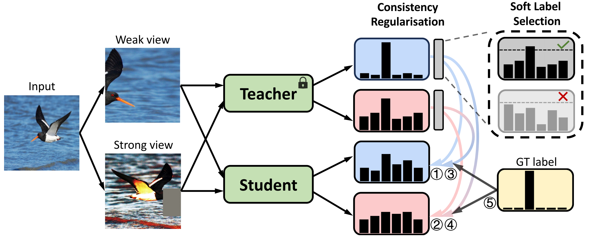

# [ACM MM'24] CRLD: Cross-View Consistency Regularisation for Knowledge Distillation

## Introduction
This repository contains a PyTorch implementation of [CRLD](https://openreview.net/pdf/9274b4bd2a934480beee273794607b4d9a3ea7d5.pdf) based on the [mdistiller](https://github.com/megvii-research/mdistiller) codebase.
CRLD exploits within-view and cross-view consistency regularisation for knowledge distillation and reports state-of-the-art performance on CIFAR-100, Tiny-ImageNet, and ImageNet datasets.

<p align="center">
    
</p>

This code is based on the implementation of [NormKD](https://github.com/gizi1/NormKD) and [MLLD](https://github.com/Jin-Ying/Multi-Level-Logit-Distillation).
For environment set-up, data organisation, and pretrained models, please refer to [DKD](https://github.com/megvii-research/mdistiller).


## Training
For CIFAR-100 experiments, you may do
```bash
    python tools/train_crld.py --cfg configs/cifar100/crld/res32x4_res8x4.yaml
```
For Tiny-ImageNet experiments, you may do
```bash
    python tools/train_crld.py --cfg configs/tinyimagenet200/vit_resnet18.yaml
```

For ImageNet experiments, you may do
```bash
    python tools/train_crld.py --cfg configs/imagenet/r34_r18/crld.yaml
```


## Citation
If you find our paper helpful to your work, you may cite it as:
```
@inproceedings{crld,
author = {Weijia Zhang and Dongnan Liu and Weidong Cai and Chao Ma},
title = {Cross-View Consistency Regularisation for Knowledge Distillation},
booktitle = {ACM MM},
year = {2024}
}
```
